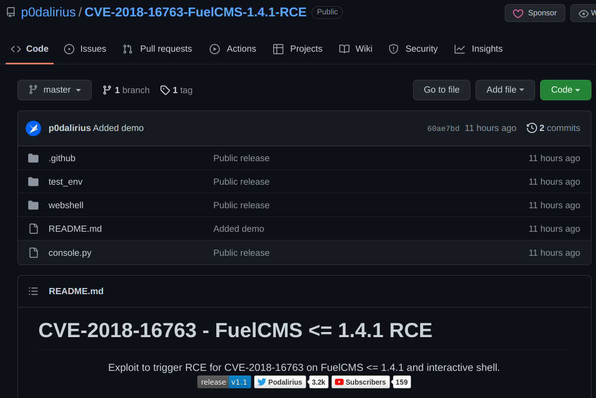

# FuelCMS - CVE-2018-16763

## Requirements

 - FuelCMS version <= 1.4.1

## Exploitation

### Download the exploit 

https://github.com/p0dalirius/CVE-2018-16763-FuelCMS-1.4.1-RCE



### Trigering the exploit

```
./console.py -t http://TARGET/ 
```


## References
 - https://www.getfuelcms.com/
 - https://www.exploit-db.com/exploits/50477
