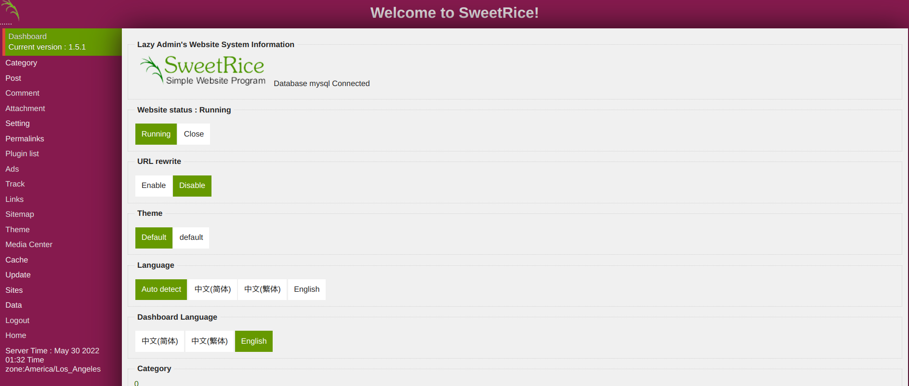
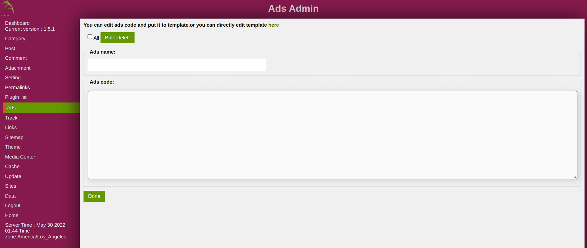
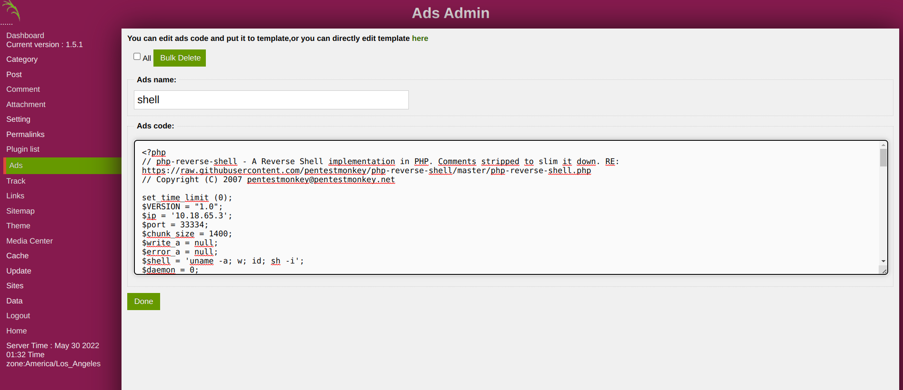
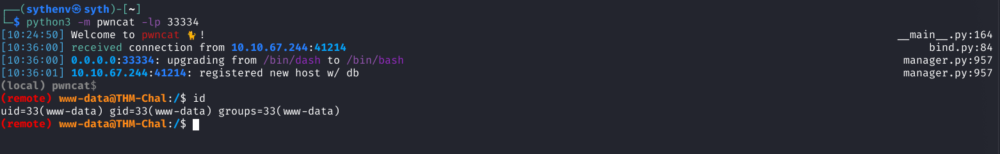

# SweetRice - Add an shell ad

## Requirements

 - A valid **username and password** of a user with **admin rights** on the SweetRice.

## Exploitation

### Accessing the dashboard

Connect with a user with administrative rights on the SweetRice at [http://TARGET/as/](http://TARGET/as).

### Installing the plugin

Then go on the "Ads" page.

### Get you favorite PHP Reverse shell

Here we using the pentestmonkey's reverse shell (https://github.com/pentestmonkey/php-reverse-shell)

### Using the ad

To use the webshell ad, just access this page http://TARGET/inc/ads/shell.php

## References

- https://www.sweetrice.xyz/
- https://github.com/pentestmonkey/php-reverse-shell