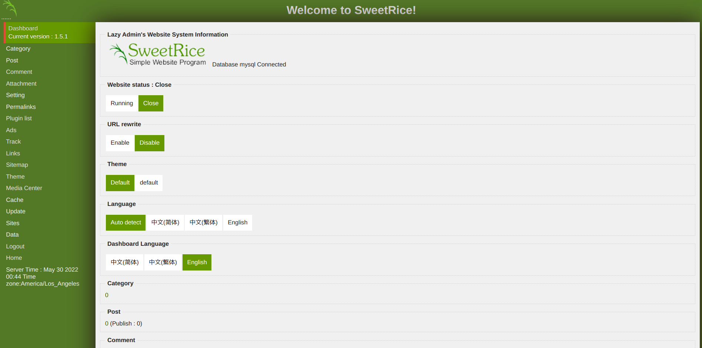
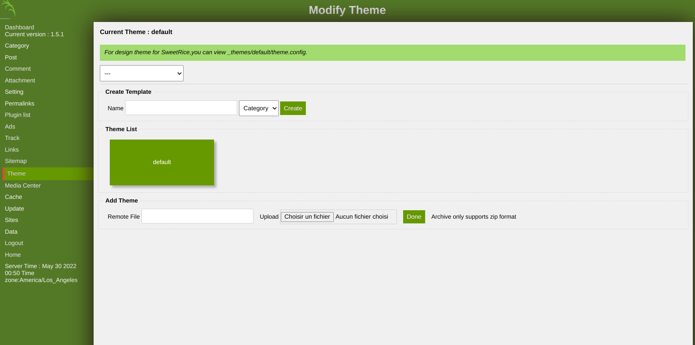
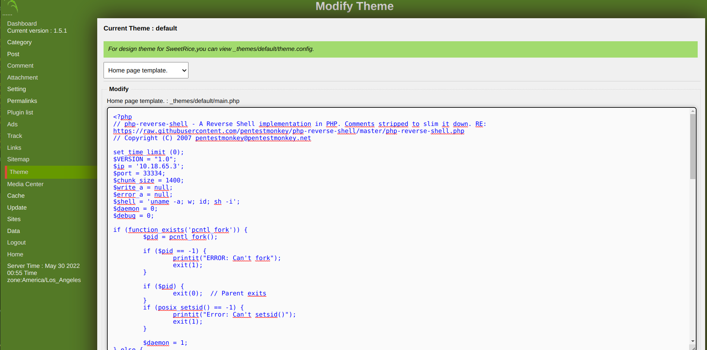
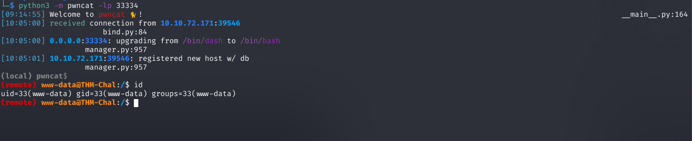

# SweetRice - Modify theme to include PHP code

## Requirements

 - A valid **username and password** of a user with **admin rights** on SweetRice.

## Exploitation

### Accessing the dashboard

Connect with a user with administrative rights on SweetRice at [http://TARGET/as/](http://TARGET/as/).

### Accessing the theme-editor

Now access the theme-editor in "Theme" at [http://TARGET/as/?type=theme](http://TARGET/as/?type=theme)

Then edit the theme to add PHP code inside the page:

You can find reverse shell PHP payloads here: https://podalirius.net/en/articles/unix-reverse-shells-cheatsheet/#php

### Enjoy your shell

Now, prepare your listener with netcat (`nc -lvp <port>`) [here we use pwncat] and enjoy your shell:

## References
 - https://www.sweetrice.xyz/
 - https://podalirius.net/en/articles/unix-reverse-shells-cheatsheet/#php