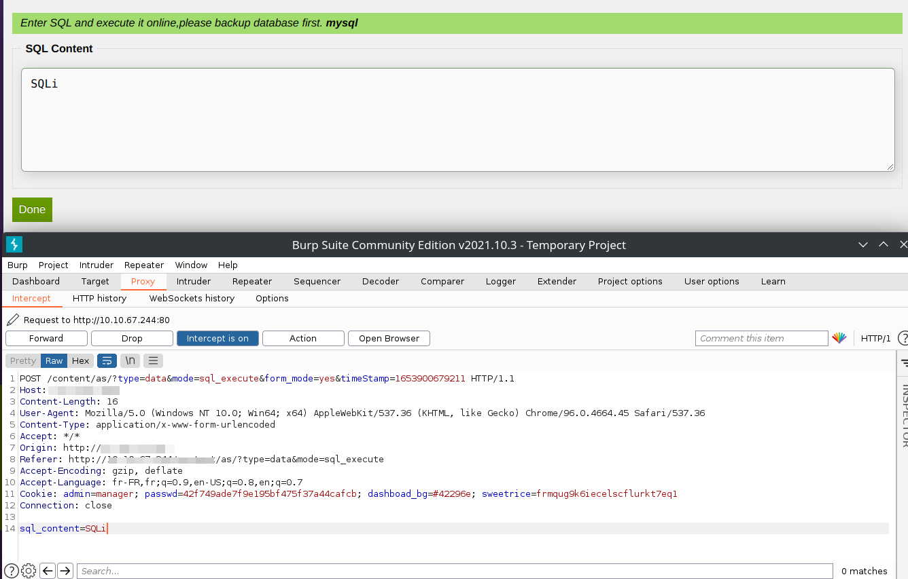
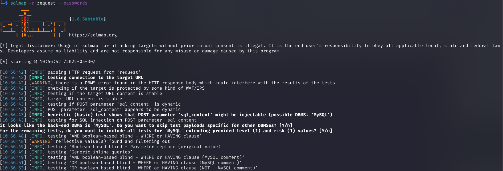
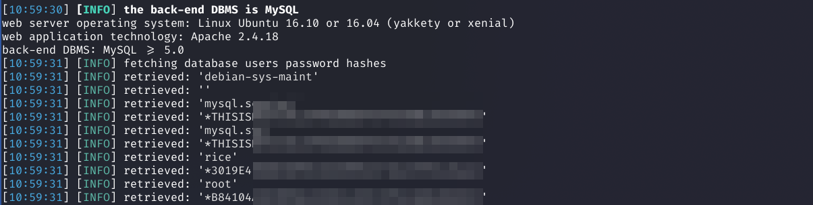

# SweetRice - SQL injection

## Requirements

 - A valid **username and password** of a user with **admin rights** on the SweetRice.

## Exploitation

### Accessing the dashboard

Connect with a user with administrative rights on the SweetRice at [http://TARGET/as/](http://TARGET/as).

### Go to DATA > SQL Execute page

You can go directly on this page http://TARGET/as/?type=data&mode=sql_execute

### Capture a Request

We send a request from the page, capture it with Burp and save the request in a file

### Retreive data using sqlmap

To get data from the database, use sqlmap with the request.

## References

- https://www.sweetrice.xyz/
- https://github.com/sqlmapproject/sqlmap
- https://portswigger.net/burp