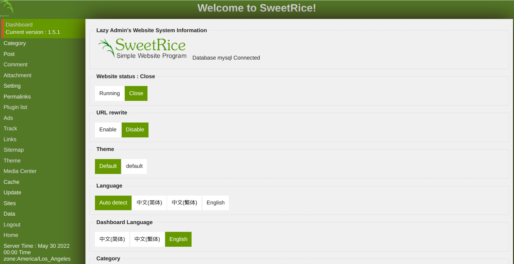
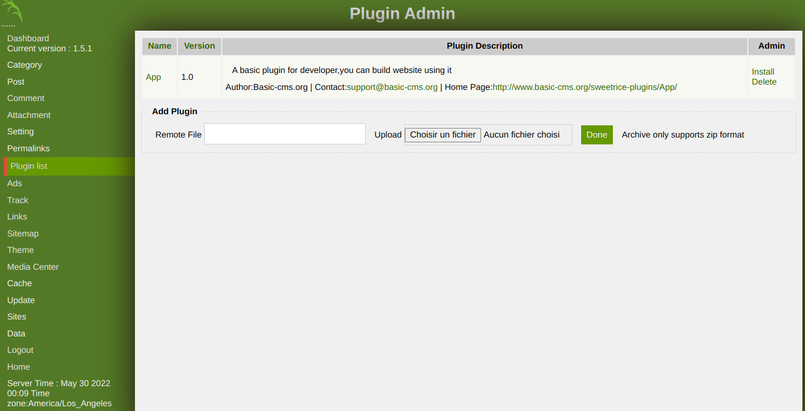

# SweetRice - Upload a plugin

## Requirements

 - A valid **username and password** of a user with **admin rights** on the SweetRice.

## Exploitation

### Accessing the dashboard

Connect with a user with administrative rights on the Wordpress at [http://TARGET/as/](http://TARGET/as).

### Installing the plugin

Then go on the "Plugin list" page.

### Get you favorite PHP Reverse shell, zip it, and upload it

### Using the plugin

To use the webshell plugin, just access this page http://TARGET/wordpress/wp-admin/tools.php?page=wpterm

## References