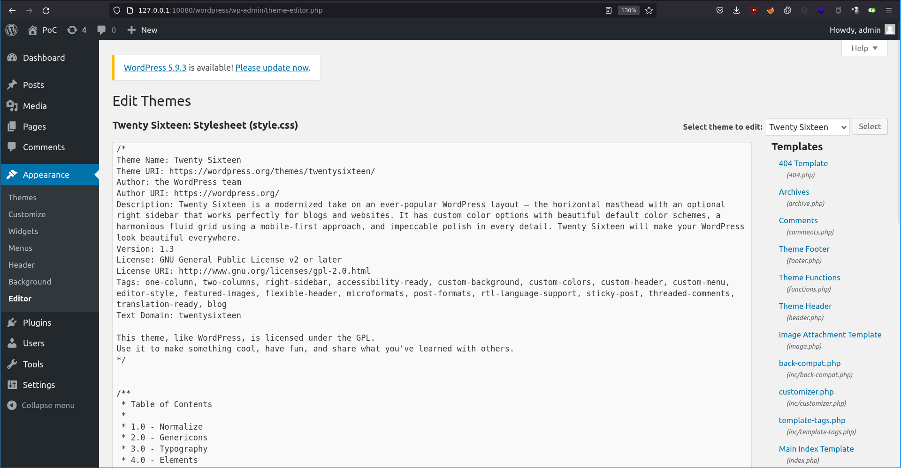
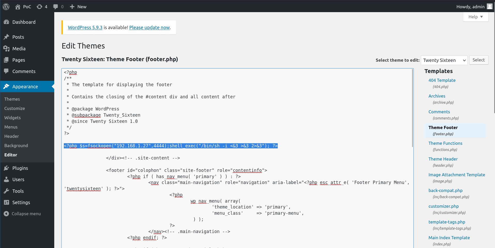

# Wordpress - Modify theme to include PHP code

## Requirements

 - A valid **username and password** of a user with **admin rights** on the Wordpress.

## Exploitation

### Accessing the dashboard

Connect with a user with administrative rights on the Wordpress at [http://TARGET/wp-login.php](http://TARGET/wp-login.php).

### Accessing the theme-editor

Now access the theme-editor in "Appearance / Editor" at [http://TARGET/wordpress/wp-admin/theme-editor.php](http://TARGET/wordpress/wp-admin/theme-editor.php)

Then edit the theme to add PHP code inside the page:

You can find reverse shell PHP payloads here: https://podalirius.net/en/articles/unix-reverse-shells-cheatsheet/#php

### Enjoy your shell

Now, prepare your listener with netcat (`nc -lvp <port>`) and enjoy your shell:

## References
 - https://wordpress.org/
 - https://podalirius.net/en/articles/unix-reverse-shells-cheatsheet/#php