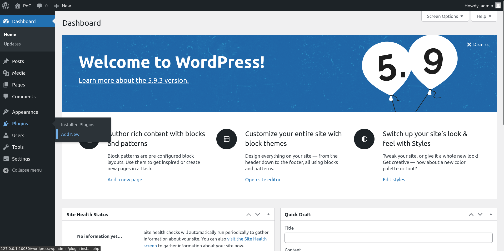
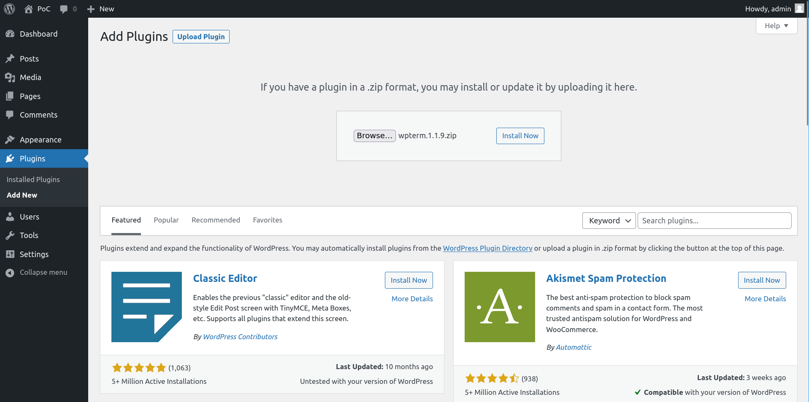
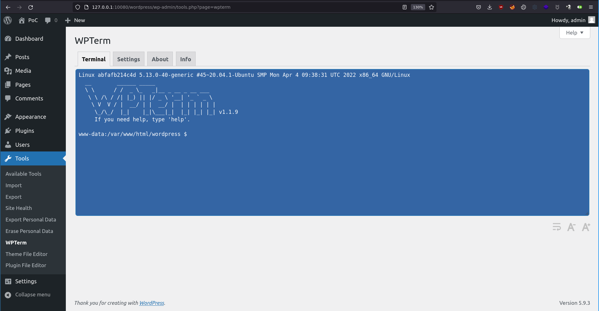

# Wordpress - Upload a plugin

## Requirements

 - A valid **username and password** of a user with **admin rights** on the Wordpress.

## Exploitation

### Accessing the dashboard

Connect with a user with administrative rights on the Wordpress at [http://TARGET/wp-login.php](http://TARGET/wp-login.php).

### Installing the plugin

Then go on the "Upload plugin" page.

Now, upload the plugin [wpterm](./wpterm.1.1.9.zip) to get a webshell plugin into Wordpress admin console.

### Using the plugin

To use the webshell plugin, just access this page http://TARGET/wordpress/wp-admin/tools.php?page=wpterm

## References
 - https://wordpress.org/plugins/wpterm/