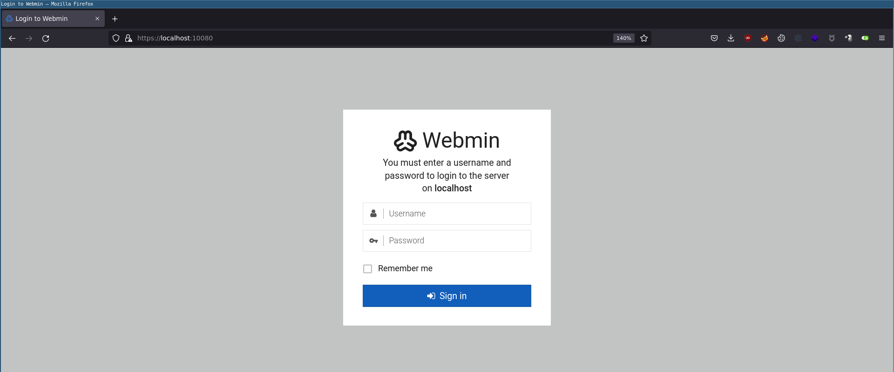
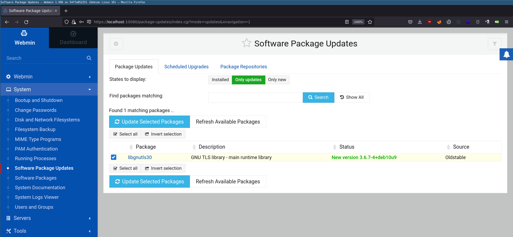
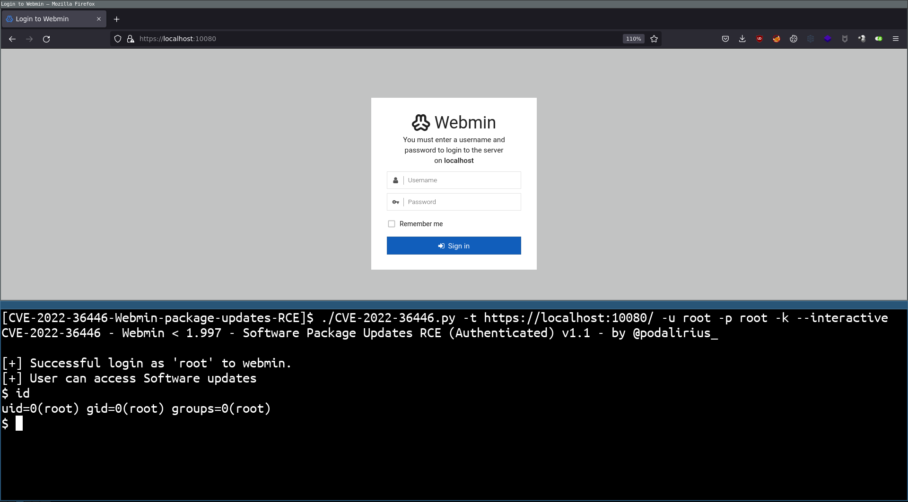

# Webmin < 1.997 - CVE-2022-36446 Remote Code Execution (RCE) (Authenticated) 

## Requirements

 - Username and password of an account with rights to access to "Software packages Updates"

## Checking requirements

If we want to check the requirements for this exploit, we first need to login to Webmin using the username and password:



Then we need to have access to the "Software Package Updates" page (at: https://TARGET/package-updates/index.cgi?mode=updates&xnavigation=1)



If both of these steps are completed successfully, we can now exploit this Webmin.

## Exploitation

Given that we need to authenticate to the Webmin and send a post request with a few parameters, it's easier to use a script for this technique. In the following tutorial we will use @p0dalirius's script: https://github.com/p0dalirius/CVE-2022-36446-Webmin-Software-Package-Updates-RCE

### Single command

We can launch a single command on the remote machine with option `--command`:

```
./CVE-2022-36446.py -t https://localhost:10080/ -u root -p root -k --interactive
```


### Interactive mode

We can also start it in interactive mode with option `--interactive` to get a pseudo-shell:

```
./CVE-2022-36446.py -t https://localhost:10080/ -u root -p root -k --interactive
```



## References
 - https://github.com/p0dalirius/CVE-2022-36446-Webmin-Software-Package-Updates-RCE
 - https://medium.com/@emirpolat/cve-2022-36446-webmin-1-997-7a9225af3165
 - https://nvd.nist.gov/vuln/detail/CVE-2022-36446
 - https://netix.dl.sourceforge.net/project/webadmin/webmin/1.996/webmin-1.996.tar.gz
 - https://github.com/advisories/GHSA-3q8j-9w3h-v6p5
